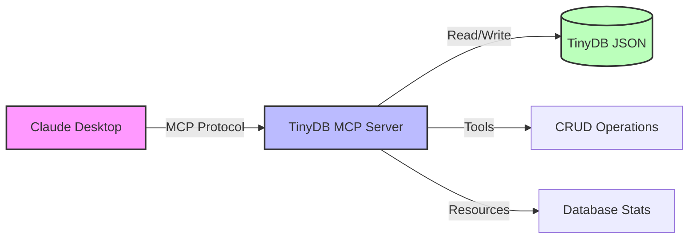

# 🗄️ TinyDB MCP Server


A production-ready Model Context Protocol (MCP) server for TinyDB document database operations.

---

## 📋 Overview

This MCP server enables AI assistants and other MCP clients to perform document database operations using **TinyDB**, a lightweight JSON-based database for Python.



**Perfect for:**
- 🎯 Local development and prototyping
- 🤖 AI assistant integrations via MCP
- 📦 Small-scale applications
- 🧪 Testing and experimentation

## Features

### Tools

| Tool | Description |
|------|-------------|
| **insert_document** | Insert a document into a table |
| **query_documents** | Query documents with optional field/value filtering |
| **update_documents** | Update documents matching specific criteria |
| **delete_documents** | Delete documents (with optional filtering) |
| **list_tables** | List all available tables in the database |

### Resources

| Resource URI | Description |
|--------------|-------------|
| `tinydb://stats` | Database statistics including document counts |
| `tinydb://tables` | List of all tables with metadata |
| `tinydb://table/{table_name}` | Contents of a specific table |

## Installation

1. Clone the repository and navigate to the project directory

2. Install dependencies using uv:
```bash
uv sync
```

## Usage

### Running the Server

**Option 1: Direct Python (Development)**

Start the MCP server using stdio transport:
```bash
python main.py
```

**Option 2: Docker (Production)**

Run the server in a container:
```bash
# Build and start with docker-compose
docker-compose up -d

# View logs
docker-compose logs -f

# Stop the container
docker-compose down

# Or build and run directly with Docker
docker build -t mcp-tinydb-server .
docker run -it --rm \
  -v tinydb-data:/data \
  -e TINYDB_PATH=/data/tinydb_data.json \
  mcp-tinydb-server
```

**Benefits of Docker:**
- Isolated environment
- Consistent deployment across systems
- Persistent data storage via volumes
- No local Python/dependency setup required
- Non-root user execution for security

### Configuring MCP Client

Add this server to your MCP client configuration. The configuration file location varies by OS:

- **macOS**: `~/Library/Application Support/Claude/claude_desktop_config.json`
- **Windows**: `%APPDATA%\Claude\claude_desktop_config.json`
- **Linux**: `~/.config/Claude/claude_desktop_config.json`

**Recommended: Docker configuration** (no Python/dependencies needed):

First, build the Docker image:
```bash
docker build -t mcp-tinydb-server .
```

Then add to Claude Desktop config:
```json
{
  "mcpServers": {
    "tinydb": {
      "command": "docker",
      "args": [
        "run",
        "--rm",
        "-i",
        "--name", "mcp-tinydb-claude",
        "-v", "mcp-tinydb-data:/data",
        "mcp-tinydb-server"
      ]
    }
  }
}
```

**Benefits of Docker configuration:**
- No local Python or uv installation required
- Isolated environment
- Persistent data via Docker volume
- Automatic cleanup with `--rm` flag
- Easy to update (just rebuild image)

**Alternative: Local development with uv**:
```json
{
  "mcpServers": {
    "tinydb": {
      "command": "/path/to/uv",
      "args": [
        "--directory",
        "/path/to/mcp-tinydb-server",
        "run",
        "python",
        "main.py"
      ]
    }
  }
}
```

**Important for local development**:
- Replace `/path/to/uv` with your uv installation path (find it with `which uv` in terminal)
- Replace `/path/to/mcp-tinydb-server` with your project directory
- GUI applications like Claude Desktop don't inherit your terminal's PATH, so use absolute paths

After updating the configuration:
1. Save the file
2. Restart Claude Desktop
3. The TinyDB tools and resources will appear in the MCP tools list

## Example Operations

### Insert a Document
```
Use the insert_document tool:
- data: {"name": "Alice", "age": 30, "city": "NYC"}
- table: "users"
```

### Query Documents
```
Use the query_documents tool:
- field: "city"
- value: "NYC"
- table: "users"

Or get all documents:
- table: "users"
(leave field and value empty)
```

### Update Documents
```
Use the update_documents tool:
- field: "name"
- value: "Alice"
- updates: {"age": 31}
- table: "users"
```

### Delete Documents
```
Use the delete_documents tool:
- field: "name"
- value: "Alice"
- table: "users"
```

### List Tables
```
Use the list_tables tool (no parameters needed)
```

### View Database Statistics
```
Read the tinydb://stats resource
```

### View Table Contents
```
Read the tinydb://table/users resource (replace 'users' with your table name)
```

## Database

The server creates a `tinydb_data.json` file to store all data. This file is created automatically on first use.

**Local Development:** Database is stored in the project root directory

**Docker:** Database is stored in a Docker volume at `/data/tinydb_data.json` inside the container, persisted across container restarts

**Configuration:** Set `TINYDB_PATH` environment variable to customize the database location

## Project Structure

```
mcp-tinydb-server/
├── src/
│   ├── __init__.py
│   └── mcp_tinydb_server.py   # Main server implementation
├── tests/                      # Test suite
│   ├── __init__.py
│   ├── test_tinydb_manager.py
│   ├── test_tools.py
│   └── test_resources.py
├── main.py                     # Entry point
├── pyproject.toml             # Dependencies
├── tinydb_data.json           # Database file (created on first use)
└── README.md                  # This file
```

## Development

### Requirements
- Python 3.14+
- mcp[cli] >= 1.23.1
- tinydb >= 4.8.0

### VS Code Tasks

This project includes VS Code tasks for common operations. Run tasks via `Cmd+Shift+P` → "Tasks: Run Task":

**Quick Commands:**
- `⇧⌘B` - Build Docker image
- Testing panel - Run tests with UI
- `F5` - Debug MCP server or tests

**Available Tasks:**
- Testing: Run All Tests, Run with Coverage
- Code Quality: Lint, Fix, Format with Ruff, Type Check (ty)
- Docker: Build, Start, Stop, View Logs
- Development: Run MCP Server, Install Dependencies

See `.vscode/tasks.json` for the full list of available tasks.

### Testing

Run the test suite with pytest:
```bash
uv run pytest tests/ -v
```

The test suite includes 46 tests covering:
- TinyDBManager class (9 tests)
- All MCP tools (23 tests)
- All MCP resources (14 tests)

You can also test the server using the MCP Inspector or any MCP client. The server runs over stdio transport and follows the MCP specification.

## Troubleshooting

### "Failed to spawn process" error in Claude Desktop

If you see this error in the Claude Desktop logs (`~/Library/Logs/Claude/mcp-server-tinydb.log` on macOS):

```
Failed to spawn process: No such file or directory
```

**Solution**: Use the absolute path to the `uv` command in your configuration:
```bash
# Find your uv path
which uv

# Use that full path in claude_desktop_config.json
# Example: /Users/YOUR_USERNAME/.local/bin/uv
```

GUI applications don't have access to your terminal's PATH environment variable, so relative commands like `uv` won't be found.

### Finding Claude Desktop logs

- **macOS**: `~/Library/Logs/Claude/mcp-server-tinydb.log`
- **Windows**: `%APPDATA%\Claude\logs\mcp-server-tinydb.log`
- **Linux**: `~/.config/Claude/logs/mcp-server-tinydb.log`

## License

See LICENSE file for details.